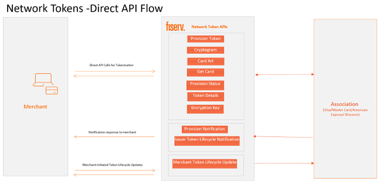

## Welcome to Network Tokens
The Fiserv Network Tokens direct APIs are built on the foundation of REST. The APIs accept standard JSON requests and return JSON encoded responses while leveraging industry standard HTTP status codes for a seamless integration. Interaction through our Network Tokens direct APIs provides the developer community the ability to provision token, request cryptogram, retrieve card art and receive lifecycle updates in a seamless manner.
- Provisioning through our APIs allows easy access to Network Tokens quickly because of Fiserv well built integration to major card networks
- Request cryptogram to use along with Network Tokens for all your consumer initiated transactions as a processor agnostic model.
- Receive card art on demand to display images withing your digital wallet or mobile application.
- Get underlying PAN information on demand post lifecycle updates.

## Overview
Network Token direct APIs are available across multiple data/information produced by the set of services a merchant uses. The following diagram depicts typical flow of information through the processes. Our APIs provide you with the ability to pull or push information back to the merchant or the wallet provider.

<!-- !align: center -->

## Provision Token
Provision token refers to the process of securing the sensitive payment information by provisioning a Network Token for a card with the network association and sending the same to the merchant. Tokens are provisioned asynchronously with the card schemes due to TPS limitations on the issuer end and are sent to the merchant as a push notification.
## Cryptogram
Cryptogram is secure alpha-numeric value provided by the card schemes that adds additional layer of security for every consumer-initiated transaction. Each cryptogram is unique to the network token, the onboarded merchant and the authorized transaction. Cryptograms are for single use only and should not be stored.
## Card Art
Card art are digital assets provided by card schemes to make your card program stand out. Whether you want to enhance consumer experience or have your brand highlighted with custom designed logos and images, card art API allows you to retrieve the digital asset ids from the card schemes and return it back to be used in digital wallets or mobile applications.
## Get Card
Often as a digital wallet provider or mobile application user, you would like to see the last 4 digits of your PAN displayed within the wallet or the application. Get Card API allows you accomplish this by retrieving the encrypted PAN information to you that can be decrypted and the last 4 digits of the PAN displayed to the user.
## Provision Token Status
As a consumer of Provision Token API, you would want to know the status of token provisioning before the notification is sent from Fiserv to you. Provision Token Status API helps you address this by returning the current status of the token provisioning so that you can make informed decision with respect to your authorization.
## Token Detail
Token Detail API can be used to retrieve the status and other pertinent details of the token so that you can keep your token vault in sync with the card schemes. It is often necessary to keep the token status current to avoid transaction decline on token authorization.
## Push Notification
Notifications are often sent as push notifications to consumer today by banks when doing digital transactions either online or using wallet payments like Apple Pay or Google Pay.
Similarly, Fiserv Push Notification API will push updates to you for sending the actual Network Token once it has been provisioned with the card schemes. Similarly, token lifecycle updates are also pushed to you to maintain the current status of the token in synch with card schemes. In both cases you would have to provide a webhook notification endpoint to send the notifications.
## Encryption Key
As card information is PCI data, Encryption key API provides you the ability of encrypting the underlying PAN which can then be sent to provisioning API for tokenization. This API will provide you the public key to encrypt the payload content.

